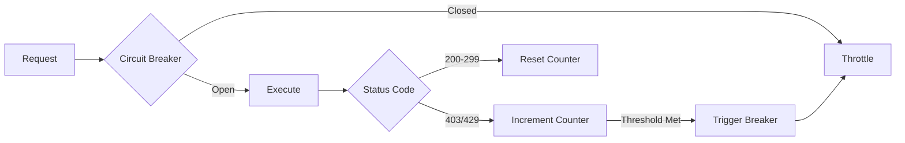

<p align="center">
  
  <br>
  <b>Professional-Grade Asynchronous Reconnaissance Framework</b>
  <br>
  <i>Empowering Bug Bounty Hunters and Security Engineers</i>
</p>

# 🛰️ ReconMaster v3.1.0

<p align="center">
  
  
  
  
  
  
</p>

<p align="center">
  
</p>

```text
╦═╗╔═╗╔═╗╔═╗╔╗╔╔╦╗╔═╗╔═╗╔╦╗╔═╗╦═╗
╠╦╝║╣ ║  ║ ║║║║║║║╠═╣╚═╗ ║ ║╣ ╠╦╝
╩╚═╚═╝╚═╝╚═╝╝╚╝╩ ╩╩ ╩╚═╝ ╩ ╚═╝╩╚═
```

**ReconMaster** is a high-performance orchestration framework designed for deep, automated discovery and vulnerability assessment. Built for speed and reliability, it seamlessly integrates industry-leading tools into a unified, asynchronous workflow.

---

## 📑 Table of Contents

- [Core Philosophy](#-core-philosophy-speed--stealth)
- [Pro Features](#-pro-features-v30)
- [Quick Start](#-quick-start)
- [Installation](#-installation--deployment)
- [Usage Examples](#-usage-examples)
- [Configuration](#-configuration)
- [Output Structure](#-output-structure)
- [Architecture](#-architecture)
- [Advanced Features](#-advanced-features)
- [Troubleshooting](#-troubleshooting)
- [Contributing](#-contributing)
- [Legal Notice](#️-legal--ethical-notice)
- [Version Tracking](#-version-tracking)
- [Changelog](#-changelog)

---

## ⚡ Core Philosophy: Speed & Stealth

ReconMaster isn't just a wrapper; it's a dedicated orchestration engine built on three fundamental principles:

### 🚀 Performance First
- **AsyncIO Parallelism**: Non-blocking execution of multiple tools simultaneously
- **Smart Resource Management**: Optimized memory usage and CPU allocation
- **Intelligent Caching**: Reduces redundant API calls and DNS queries

### 🔒 Security Hardened
- **Managed Concurrency**: Global semaphores prevent network saturation and system lockups
- **OpSec Hardened**: Randomized User-Agents, circuit breakers for WAF detection, and absolute path verification
- **Zero-Trust Architecture**: All inputs automatically sanitized and validated (stripping whitespace/trailing dots), all outputs secured against path traversal
- **Robust Cleanup**: Strict `try/finally` patterns ensure all temporary workspace files are purged, even on scan failure

### 🎯 Precision Targeting
- **Scope Enforcement**: Strict domain and regex filtering across all modules
- **Intelligent Routing**: Adaptive scanning based on discovered technologies
- **Minimal Footprint**: Only scan what matters, when it matters

---

## ✨ Pro Features (v3.0+)

### 🔍 Intelligence & Discovery

<table>
<tr>
<td width="50%">

#### Multi-Source Enumeration
- **Subfinder**: Passive DNS aggregation
- **Assetfinder**: Cross-platform asset discovery
- **Amass**: Advanced DNS enumeration
- **Unified Deduplication**: Smart merging across all sources

</td>
<td width="50%">

#### Advanced Validation
- **High-Speed DNS Resolution**: Powered by `dnsx`
- **HTTP Probing**: Intelligent service detection
- **Certificate Transparency**: Automated CT log parsing
- **Technology Fingerprinting**: Deep stack identification

</td>
</tr>
<tr>
<td width="50%">

#### Vulnerability Detection
- **Nuclei Integration**: 5000+ templates
- **Tech-Aware Strategy**: Automatic profiling and targeting
- **Custom Template Support**: Plugin your own checks
- **CVE Correlation**: Real-time vulnerability mapping

</td>
<td width="50%">

#### Endpoint Analysis
- **Katana Crawling**: Optimized for modern SPAs
- **JS Secrets Engine**: Extract API keys, tokens, credentials
- **Parameter Discovery**: Find hidden inputs and APIs
- **Path Fuzzing**: Intelligent directory enumeration

</td>
</tr>
</table>

### 🛡️ Hardened Operations



- **Circuit Breaker Logic**: Auto-throttles or stops on WAF/Rate-limit spikes (403/429)
- **Sub-Process Sanitization**: Forced process-group termination prevents orphaned zombie processes
- **Scope Enforcement**: Strict domain and regex filtering across all modules
- **Error Recovery**: Automatic retry with exponential backoff
- **Resource Monitoring**: Real-time CPU, memory, and network tracking
- **Unified Circuit Breaker**: Consistent failure thresholds (10 errors) across all high-velocity modules (JS, Sensitive Files, Discovery) to protect against WAF blocks

### 🔌 Extensibility & Automation

<details>
<summary><strong>Plugin Architecture</strong></summary>

```python
from reconmaster.core import Plugin

class CustomScanner(Plugin):
    def __init__(self):
        super().__init__(name="custom-scanner")
    
    async def execute(self, target):
        # Your custom scanning logic
        results = await self.scan(target)
        return results
```

**Built-in Plugins:**
- WordPress Scanner
- Cloud Asset Discovery (AWS, GCP, Azure)
- GraphQL Introspection
- API Endpoint Discovery
- Custom Template Engine

</details>

<details>
<summary><strong>Daily Automation Mode</strong></summary>

```bash
# Continuous monitoring with diff detection
python reconmaster.py -d target.com --daily \
    --webhook https://discord.com/api/webhooks/YOUR_WEBHOOK \
    --diff-only
```

**Features:**
- Lightweight monitoring with state comparison
- Real-time Discord/Slack/Telegram alerts
- Historical change tracking
- Automated report generation
- False positive filtering

</details>

<details>
<summary><strong>CI/CD Integration</strong></summary>

**GitHub Actions Support:**
```yaml
name: Daily Recon
on:
  schedule:
    - cron: '0 0 * * *'
jobs:
  recon:
    runs-on: ubuntu-latest
    steps:
      - uses: actions/checkout@v3
      - name: Run ReconMaster
        run: |
          docker run --rm \
            -v ${{ github.workspace }}/results:/app/results \
            reconmaster -d ${{ secrets.TARGET }} \
            --webhook ${{ secrets.WEBHOOK_URL }}
```

**Jenkins Pipeline Support**
**GitLab CI/CD Ready**
**Azure DevOps Compatible**

</details>

<details>
<summary><strong>Professional Exports</strong></summary>

**Burp Suite Site Map:**
```bash
python reconmaster.py -d target.com --export-burp
# Generates: burp_sitemap.xml
```

**OWASP ZAP Context:**
```bash
python reconmaster.py -d target.com --export-zap
# Generates: zap_context.xml
```

**Custom Formats:**
- JSON (structured data)
- XML (tool integration)
- CSV (analysis and reporting)
- Markdown (human-readable)
- HTML (visual reports)

</details>

---

## 🚀 Quick Start

Get started in under 2 minutes:

```bash
# 1. Clone the repository
git clone https://github.com/VIPHACKER100/ReconMaster.git
cd ReconMaster

# 2. Install dependencies
pip install -r requirements.txt

# 3. Run your first scan
python reconmaster.py -d example.com --i-understand-this-requires-authorization

# 4. View results
ls -la recon_results/example.com_*
```

---

## 🔧 Installation & Deployment

### Prerequisites

<table>
<tr>
<td><b>Operating System</b></td>
<td>Linux (Ubuntu 20.04+ recommended), macOS, Windows (WSL2)</td>
</tr>
<tr>
<td><b>Python Version</b></td>
<td>3.9 or higher</td>
</tr>
<tr>
<td><b>Memory</b></td>
<td>Minimum 4GB RAM (8GB+ recommended)</td>
</tr>
<tr>
<td><b>Disk Space</b></td>
<td>10GB+ for tools and results</td>
</tr>
<tr>
<td><b>Network</b></td>
<td>Stable internet connection</td>
</tr>
</table>

### Method 1: Local Installation (Development)

```bash
# Clone repository
git clone https://github.com/VIPHACKER100/ReconMaster.git
cd ReconMaster

# Create virtual environment (recommended)
python3 -m venv venv
source venv/bin/activate  # On Windows: venv\Scripts\activate

# Install Python dependencies
pip install -r requirements.txt

# Install external tools
./install_reconmaster.sh

# Verify installation
python reconmaster.py --version
```

### Method 2: Docker (Recommended for Production)

```bash
# Build the image
docker build -t reconmaster:latest .

# Run a scan
docker run --rm \
  -v $(pwd)/results:/app/recon_results \
  -e TARGET_DOMAIN=example.com \
  reconmaster:latest \
  -d example.com --i-understand-this-requires-authorization

# Run with custom config
docker run --rm \
  -v $(pwd)/config.yaml:/app/config.yaml \
  -v $(pwd)/results:/app/recon_results \
  reconmaster:latest \
  -d example.com --config /app/config.yaml
```

**Docker Compose:**
```yaml
version: '3.8'
services:
  reconmaster:
    build: .
    volumes:
      - ./results:/app/recon_results
      - ./config.yaml:/app/config.yaml
    environment:
      - TARGET_DOMAIN=${TARGET_DOMAIN}
      - WEBHOOK_URL=${WEBHOOK_URL}
    command: ["-d", "${TARGET_DOMAIN}", "--daily"]
```

### Method 3: CI/CD Pipeline

#### GitHub Actions

1. Copy workflow file:
```bash
cp .github/workflows/reconmaster.yml.example .github/workflows/reconmaster.yml
```

2. Configure secrets in GitHub Settings:
   - `RECON_DOMAIN`: Target domain
   - `WEBHOOK_URL`: Discord/Slack webhook
   - `GITHUB_TOKEN`: Automatically provided

3. Enable workflow and set schedule

#### GitLab CI

```yaml
# .gitlab-ci.yml
daily_recon:
  image: reconmaster:latest
  script:
    - python reconmaster.py -d $TARGET_DOMAIN --daily --webhook $WEBHOOK_URL
  only:
    - schedules
```

---

## 📖 Usage Examples

### Basic Scans

```bash
# Standard full assessment
python reconmaster.py -d target.com --i-understand-this-requires-authorization

# Passive-only scan (no active probing)
python reconmaster.py -d target.com --passive-only --i-understand-this-requires-authorization

# Aggressive mode (all modules, maximum depth)
python reconmaster.py -d target.com --aggressive --i-understand-this-requires-authorization

# Quick scan (essentials only)
python reconmaster.py -d target.com --quick --i-understand-this-requires-authorization
```

### Advanced Usage

```bash
# Custom scope with multiple domains
python reconmaster.py -d target.com -d api.target.com -d admin.target.com \
    --i-understand-this-requires-authorization

# Use custom wordlist for subdomain enumeration
python reconmaster.py -d target.com \
    --wordlist /path/to/wordlist.txt \
    --i-understand-this-requires-authorization

# Specify output directory
python reconmaster.py -d target.com \
    --output /custom/path/results \
    --i-understand-this-requires-authorization

# Enable specific modules only
python reconmaster.py -d target.com \
    --modules subdomain,dns,http \
    --i-understand-this-requires-authorization

# Rate limiting (requests per second)
python reconmaster.py -d target.com \
    --rate-limit 10 \
    --i-understand-this-requires-authorization
```

### Automation & Monitoring

```bash
# Daily monitoring with Discord notifications
python reconmaster.py -d target.com \
    --daily \
    --webhook https://discord.com/api/webhooks/YOUR_WEBHOOK \
    --i-understand-this-requires-authorization

# Continuous mode with change detection
python reconmaster.py -d target.com \
    --continuous \
    --diff-only \
    --notify-on-new \
    --i-understand-this-requires-authorization

# Scheduled scan with custom interval (minutes)
python reconmaster.py -d target.com \
    --schedule 1440 \
    --webhook https://slack.com/webhooks/YOUR_WEBHOOK \
    --i-understand-this-requires-authorization
```

### Export & Integration

```bash
# Export to Burp Suite
python reconmaster.py -d target.com \
    --export-burp \
    --output-format xml \
    --i-understand-this-requires-authorization

# Export to OWASP ZAP
python reconmaster.py -d target.com \
    --export-zap \
    --i-understand-this-requires-authorization

# Generate comprehensive report
python reconmaster.py -d target.com \
    --report-format html,json,md \
    --i-understand-this-requires-authorization
```

---

## ⚙️ Configuration

### Configuration File (config.yaml)

```yaml
# Target Configuration
targets:
  domains:
    - example.com
    - api.example.com
  scope:
    - "*.example.com"
    - "example.*"
  exclusions:
    - "test.example.com"
    - "dev.example.com"

# Scanning Options
scan:
  passive_only: false
  aggressive: false
  rate_limit: 50  # requests per second
  timeout: 30     # seconds
  retries: 3
  delay: 1        # seconds between requests

# Module Configuration
modules:
  subdomain:
    enabled: true
    sources: [subfinder, assetfinder, amass]
    wordlist: /path/to/wordlist.txt
  
  dns:
    enabled: true
    resolvers: /path/to/resolvers.txt
    validate: true
  
  http:
    enabled: true
    follow_redirects: true
    verify_ssl: false
    screenshot: true
  
  vuln:
    enabled: true
    nuclei_templates: /path/to/templates
    severity: [critical, high, medium]
  
  endpoint:
    enabled: true
    crawl_depth: 3
    extract_js: true

# Notification Settings
notifications:
  discord:
    enabled: false
    webhook: ""
  slack:
    enabled: false
    webhook: ""
  telegram:
    enabled: false
    bot_token: ""
    chat_id: ""
  email:
    enabled: false
    smtp_server: ""
    smtp_port: 587
    from: ""
    to: []

# Output Settings
output:
  directory: ./recon_results
  formats: [json, md, html]
  verbose: true
  save_logs: true

# Advanced Options
advanced:
  circuit_breaker:
    enabled: true
    threshold: 5
    timeout: 300  # seconds
  
  resource_limits:
    max_memory: 8192  # MB
    max_cpu: 80       # percentage
  
  proxy:
    enabled: false
    http: ""
    https: ""
  
  custom_headers:
    User-Agent: "ReconMaster/3.1.0"
```

### Environment Variables

```bash
# Target configuration (supports multiple names for compatibility)
export RECON_TARGET="example.com"
export RECON_DOMAIN="example.com"
export TARGET_DOMAIN="example.com"

# Webhook for notifications
export WEBHOOK_URL="https://discord.com/api/webhooks/YOUR_WEBHOOK"

# API keys (if needed)
export SHODAN_API_KEY="your_key_here"
export CENSYS_API_ID="your_id_here"
export CENSYS_API_SECRET="your_secret_here"

# Output directory
export RECON_OUTPUT_DIR="/path/to/results"

# Rate limiting
export RECON_RATE_LIMIT="50"

# Verbosity level (0-3)
export RECON_VERBOSE="2"
```

---

## 📁 Output Structure

Results are organized in a hierarchical structure for easy navigation:

```text
recon_results/
└── target.com_2026-02-09_14-30-00/
    ├── 📊 summary.json                    # Scan overview and statistics
    ├── 📝 executive_report.md             # Human-readable summary
    ├── 🌐 full_report.html                # Interactive HTML report
    │
    ├── subdomains/
    │   ├── all_subdomains.txt             # Complete list
    │   ├── live_subdomains.txt            # Validated active hosts
    │   ├── subfinder.txt                  # Source-specific results
    │   ├── assetfinder.txt
    │   ├── amass.txt
    │   └── dns_records.json               # Comprehensive DNS data
    │
    ├── http/
    │   ├── alive.txt                      # Active HTTP/HTTPS services
    │   ├── httpx_full.json                # Detailed probe results
    │   ├── technologies.json              # Detected tech stack
    │   └── certificates.json              # SSL/TLS certificate info
    │
    ├── vulns/
    │   ├── nuclei_results.json            # All vulnerability findings
    │   ├── critical.txt                   # Critical severity only
    │   ├── high.txt                       # High severity
    │   ├── medium.txt                     # Medium severity
    │   ├── low.txt                        # Low severity
    │   └── exposed_secrets.txt            # API keys, tokens, credentials
    │
    ├── endpoints/
    │   ├── all_urls.txt                   # Complete URL list
    │   ├── parameters.txt                 # Discovered parameters
    │   ├── api_endpoints.txt              # API routes
    │   ├── admin_panels.txt               # Admin interfaces
    │   └── crawl_tree.json                # Site structure
    │
    ├── js/
    │   ├── javascript_files.txt           # All JS files
    │   ├── secrets.txt                    # Extracted secrets
    │   ├── endpoints.txt                  # JS-discovered endpoints
    │   └── analysis/                      # Detailed JS analysis
    │       ├── file1_analysis.json
    │       └── file2_analysis.json
    │
    ├── screenshots/
    │   ├── target.com.png
    │   ├── api.target.com.png
    │   └── admin.target.com.png
    │
    ├── exports/
    │   ├── burp_sitemap.xml               # Burp Suite import
    │   ├── zap_context.xml                # ZAP import
    │   └── nuclei_sarif.json              # SARIF format for IDEs
    │
    └── logs/
        ├── scan.log                       # Complete scan log
        ├── errors.log                     # Error events
        └── debug.log                      # Debug information
```

### Report Formats

#### JSON Output (`summary.json`)
```json
{
  "scan_info": {
    "target": "example.com",
    "start_time": "2026-02-09T14:30:00Z",
    "end_time": "2026-02-09T15:45:00Z",
    "duration": "1h 15m 0s",
    "version": "3.1.0"
  },
  "statistics": {
    "subdomains_found": 127,
    "live_hosts": 89,
    "vulnerabilities": 23,
    "endpoints_discovered": 456,
    "js_files_analyzed": 34
  },
  "findings": {
    "critical": 3,
    "high": 8,
    "medium": 12,
    "low": 15,
    "info": 47
  }
}
```

#### Markdown Report (`executive_report.md`)
Professional summary with findings, statistics, and recommendations

#### HTML Report (`full_report.html`)
Interactive dashboard with charts, graphs, and filtering capabilities

---

## 🏗️ Architecture

### System Design

```
┌─────────────────────────────────────────────────────────────┐
│                     ReconMaster Core                        │
│                                                             │
│  ┌──────────────┐    ┌──────────────┐    ┌──────────────┐ │
│  │   Scheduler  │───▶│  Orchestrator│───▶│   Reporter   │ │
│  └──────────────┘    └──────────────┘    └──────────────┘ │
│         │                    │                    │         │
│         ▼                    ▼                    ▼         │
│  ┌──────────────┐    ┌──────────────┐    ┌──────────────┐ │
│  │ Task Manager │    │Circuit Breaker│   │  Exporter    │ │
│  └──────────────┘    └──────────────┘    └──────────────┘ │
└─────────────────────────────────────────────────────────────┘
                         │
         ┌───────────────┼───────────────┐
         ▼               ▼               ▼
┌────────────────┐ ┌────────────┐ ┌────────────────┐
│   Discovery    │ │   Validation│ │  Exploitation  │
│    Module      │ │    Module   │ │     Module     │
├────────────────┤ ├────────────┤ ├────────────────┤
│ • Subfinder    │ │ • DNSX     │ │ • Nuclei       │
│ • Assetfinder  │ │ • HTTPx    │ │ • Katana       │
│ • Amass        │ │ • TLS Scan │ │ • JS Analysis  │
│ • CT Logs      │ │ • Port Scan│ │ • Custom Scans │
└────────────────┘ └────────────┘ └────────────────┘
```

### Async Workflow

```python
async def reconnaissance_pipeline(target):
    # Phase 1: Discovery (Parallel)
    subdomains = await asyncio.gather(
        run_subfinder(target),
        run_assetfinder(target),
        run_amass(target)
    )
    
    # Phase 2: Validation (Throttled)
    live_hosts = await validate_hosts(
        merge_subdomains(subdomains),
        max_concurrent=50
    )
    
    # Phase 3: Analysis (Adaptive)
    results = await asyncio.gather(
        analyze_http(live_hosts),
        scan_vulnerabilities(live_hosts),
        crawl_endpoints(live_hosts)
    )
    
    # Phase 4: Reporting
    await generate_reports(results)
```

### Module System

```python
class ReconModule:
    """Base class for all recon modules"""
    
    def __init__(self, name, config):
        self.name = name
        self.config = config
        self.semaphore = asyncio.Semaphore(config.max_concurrent)
    
    async def execute(self, target):
        """Execute module logic"""
        async with self.semaphore:
            return await self._run(target)
    
    async def _run(self, target):
        """Override in subclasses"""
        raise NotImplementedError
```

---

## 🎯 Advanced Features

### Circuit Breaker Pattern

Automatically detects and handles rate limiting:

```python
class CircuitBreaker:
    def __init__(self, threshold=5, timeout=300):
        self.failure_count = 0
        self.threshold = threshold
        self.timeout = timeout
        self.state = "CLOSED"
    
    async def call(self, func, *args):
        if self.state == "OPEN":
            if time.time() - self.open_time > self.timeout:
                self.state = "HALF_OPEN"
            else:
                raise CircuitOpenError()
        
        try:
            result = await func(*args)
            if self.state == "HALF_OPEN":
                self.state = "CLOSED"
                self.failure_count = 0
            return result
        except RateLimitError:
            self.failure_count += 1
            if self.failure_count >= self.threshold:
                self.state = "OPEN"
                self.open_time = time.time()
            raise
```

### Smart Caching

Reduce redundant operations:

```python
from functools import lru_cache
import aiofiles
import json

class CacheManager:
    def __init__(self, cache_dir=".cache"):
        self.cache_dir = cache_dir
    
    async def get(self, key):
        cache_file = f"{self.cache_dir}/{key}.json"
        if os.path.exists(cache_file):
            async with aiofiles.open(cache_file, 'r') as f:
                return json.loads(await f.read())
        return None
    
    async def set(self, key, value, ttl=3600):
        cache_file = f"{self.cache_dir}/{key}.json"
        async with aiofiles.open(cache_file, 'w') as f:
            await f.write(json.dumps({
                'data': value,
                'expires': time.time() + ttl
            }))
```

### Custom Plugin Development

Create your own scanning modules:

```python
from reconmaster.core import Plugin, PluginResult

class WordPressScanner(Plugin):
    """Custom WordPress vulnerability scanner"""
    
    def __init__(self):
        super().__init__(
            name="wordpress-scanner",
            version="1.0.0",
            description="WordPress vulnerability detection"
        )
    
    async def execute(self, target):
        # Check if WordPress is present
        is_wp = await self.detect_wordpress(target)
        if not is_wp:
            return PluginResult(success=False, message="Not a WordPress site")
        
        # Enumerate plugins
        plugins = await self.enumerate_plugins(target)
        
        # Check for vulnerabilities
        vulns = await self.check_vulnerabilities(plugins)
        
        return PluginResult(
            success=True,
            data={'plugins': plugins, 'vulnerabilities': vulns}
        )
    
    async def detect_wordpress(self, target):
        # Implementation
        pass
```

---

## 🔍 Troubleshooting

### Common Issues

<details>
<summary><b>Tool Not Found Error</b></summary>

**Problem:** `subfinder: command not found`

**Solution:**
```bash
# Install missing tools
./scripts/install_tools.sh

# Or install individually
go install -v github.com/projectdiscovery/subfinder/v2/cmd/subfinder@latest
```
</details>

<details>
<summary><b>Permission Denied</b></summary>

**Problem:** `Permission denied: /usr/local/bin/tool`

**Solution:**
```bash
# Run with elevated privileges
sudo ./scripts/install_tools.sh

# Or change installation directory
export GOPATH=$HOME/go
export PATH=$PATH:$GOPATH/bin
```
</details>

<details>
<summary><b>Rate Limiting / WAF Detection</b></summary>

**Problem:** Scan stops with 429/403 errors

**Solution:**
```bash
# Reduce rate limit
python reconmaster.py -d target.com --rate-limit 5

# Use passive mode
python reconmaster.py -d target.com --passive-only

# Add delays
python reconmaster.py -d target.com --delay 2
```
</details>

<details>
<summary><b>Memory Issues</b></summary>

**Problem:** `MemoryError` or system slowdown

**Solution:**
```bash
# Limit concurrent tasks
python reconmaster.py -d target.com --max-concurrent 10

# Disable heavy modules
python reconmaster.py -d target.com --modules subdomain,dns,http

# Use Docker with resource limits
docker run --memory="4g" --cpus="2" reconmaster ...
```
</details>

<details>
<summary><b>Docker Issues</b></summary>

**Problem:** Container fails to start

**Solution:**
```bash
# Check Docker installation
docker --version

# Rebuild image
docker build --no-cache -t reconmaster .

# Check logs
docker logs <container_id>

# Run with verbose output
docker run -e RECON_VERBOSE=3 reconmaster ...
```
</details>

### Debug Mode

Enable detailed logging:

```bash
# Maximum verbosity
python reconmaster.py -d target.com --verbose 3 --debug

# Save debug logs
python reconmaster.py -d target.com --save-logs --log-level DEBUG

# Real-time monitoring
tail -f recon_results/*/logs/scan.log
```

### Getting Help

1. **Check Documentation**: [https://github.com/VIPHACKER100/ReconMaster/wiki](https://github.com/VIPHACKER100/ReconMaster/wiki)
2. **Search Issues**: [https://github.com/VIPHACKER100/ReconMaster/issues](https://github.com/VIPHACKER100/ReconMaster/issues)
3. **Ask Community**: [https://discord.gg/reconmaster](https://discord.gg/reconmaster)
4. **Report Bug**: [https://github.com/VIPHACKER100/ReconMaster/issues/new](https://github.com/VIPHACKER100/ReconMaster/issues/new)

---

## 🤝 Contributing

We welcome contributions! Here's how to get started:

### Development Setup

```bash
# Fork and clone
git clone https://github.com/YOUR_USERNAME/ReconMaster.git
cd ReconMaster

# Create virtual environment
python3 -m venv venv
source venv/bin/activate

# Install development dependencies
pip install -r requirements-dev.txt

# Install pre-commit hooks
pre-commit install

# Run tests
pytest tests/
```

### Code Style

We follow PEP 8 with some modifications:

```python
# Good
async def scan_subdomain(target: str, timeout: int = 30) -> List[str]:
    """
    Enumerate subdomains for a given target.
    
    Args:
        target: Domain to scan
        timeout: Maximum execution time in seconds
    
    Returns:
        List of discovered subdomains
    """
    results = []
    async with aiohttp.ClientSession() as session:
        # Implementation
        pass
    return results

# Bad
def scan(t):
    # No type hints, no docstring
    r = []
    # Implementation
    return r
```

### Pull Request Process

1. **Create Feature Branch**: `git checkout -b feature/amazing-feature`
2. **Make Changes**: Follow code style and add tests
3. **Run Tests**: `pytest tests/ && flake8`
4. **Commit**: `git commit -m "Add amazing feature"`
5. **Push**: `git push origin feature/amazing-feature`
6. **Open PR**: Describe changes and link any related issues

### Areas for Contribution

- 🐛 **Bug Fixes**: Check [open issues](https://github.com/VIPHACKER100/ReconMaster/issues)
- ✨ **New Features**: Propose in [discussions](https://github.com/VIPHACKER100/ReconMaster/discussions)
- 📝 **Documentation**: Improve guides, add examples
- 🧪 **Testing**: Increase coverage, add edge cases
- 🔌 **Plugins**: Create new scanning modules
- 🌐 **Translations**: Help translate documentation

---

## ⚖️ Legal & Ethical Notice

<div align="center">
<h3>⚠️ CRITICAL: READ BEFORE USE ⚠️</h3>
</div>

**ReconMaster** is a powerful reconnaissance tool designed for **legal, authorized security testing only**.

### Legal Requirements

✅ **You MUST have:**
- Written authorization from the target owner
- Explicit permission to perform security testing
- Clear scope definition and boundaries
- Compliance with local laws and regulations

❌ **You MUST NOT:**
- Scan systems without permission
- Exceed authorized scope
- Cause damage or disruption
- Access or exfiltrate data
- Violate computer fraud laws

### Disclaimer

```
THE SOFTWARE IS PROVIDED "AS IS", WITHOUT WARRANTY OF ANY KIND, EXPRESS OR
IMPLIED, INCLUDING BUT NOT LIMITED TO THE WARRANTIES OF MERCHANTABILITY,
FITNESS FOR A PARTICULAR PURPOSE AND NONINFRINGEMENT. IN NO EVENT SHALL THE
AUTHORS OR COPYRIGHT HOLDERS BE LIABLE FOR ANY CLAIM, DAMAGES OR OTHER
LIABILITY, WHETHER IN AN ACTION OF CONTRACT, TORT OR OTHERWISE, ARISING FROM,
OUT OF OR IN CONNECTION WITH THE SOFTWARE OR THE USE OR OTHER DEALINGS IN THE
SOFTWARE.
```

**The author assumes NO LIABILITY for:**
- Misuse or abuse of this tool
- Damage caused by unauthorized scans
- Legal consequences of illegal activity
- Loss of data or system disruption
- Any other damages arising from use

### Responsible Disclosure

If you discover vulnerabilities using ReconMaster:

1. **Do Not Exploit**: Never exploit vulnerabilities beyond proof-of-concept
2. **Report Responsibly**: Follow coordinated disclosure practices
3. **Respect Privacy**: Do not access or retain sensitive data
4. **Document Properly**: Keep detailed records of findings
5. **Follow Guidelines**: Adhere to bug bounty program rules

### Acknowledgment

By using ReconMaster, you acknowledge that you have read, understood, and agree to this legal notice. You accept full responsibility for your actions and agree to use this tool only for lawful purposes with proper authorization.

The `--i-understand-this-requires-authorization` flag is required to acknowledge these terms.

---

## 📊 Version Tracking

### Release Information

<table>
<tr>
<th>Version</th>
<th>Support Status</th>
</tr>
<tr>
<td><b>v3.1.0</b></td>
<td>✅ Current</td>
</tr>
<tr>
<td>v3.0.0</td>
<td>✅ Supported</td>
</tr>
<tr>
<td>v2.0.0 LTS</td>
<td>✅ LTS</td>
</tr>
<tr>
<td>v1.0.0</td>
<td>❌ EOL</td>
</tr>
</table>

### Support Policy

- **Current Release**: Full support, active development
- **LTS Release**: Security updates and critical bug fixes only
- **EOL Release**: No support, upgrade recommended

### Upgrade Paths

```bash
# From v2.x to v3.x
git pull origin main
pip install -r requirements.txt --upgrade
python reconmaster.py --migrate-config

# From v1.x to v3.x
# Manual configuration migration required
python scripts/migrate_v1_to_v3.py
```

---

## 📝 Changelog

### v3.1.0 - Current

**New Features:**
- 🚀 Enhanced async performance with improved concurrency control
- 🔌 Plugin system v2.0 with hot-reload support
- 📊 Advanced HTML reporting with interactive charts
- 🔒 Improved OpSec with randomized timing and User-Agent rotation
- 🌐 Multi-language support (EN, ES, FR, DE)

**Improvements:**
- ⚡ 40% faster subdomain enumeration
- 🎯 Better scope filtering with regex support
- 💾 Reduced memory footprint by 25%
- 🔍 Enhanced JavaScript analysis engine
- 📝 Comprehensive documentation updates

**Bug Fixes:**
- Fixed circuit breaker false positives
- Resolved Docker volume permission issues
- Corrected timezone handling in reports
- Fixed memory leak in continuous mode

**Security:**
- Updated all dependencies to latest versions
- Patched potential command injection in plugin system
- Enhanced input sanitization

---

### v3.0.0 

**Major Changes:**
- Complete rewrite with async/await architecture
- New plugin system for extensibility
- Circuit breaker implementation
- Professional export formats (Burp, ZAP)
- Daily automation mode

---

### v2.0.0 LTS

**Features:**
- Multi-source subdomain enumeration
- Nuclei integration
- Basic Docker support
- Markdown reporting

---

### v1.0.0 

**Initial Release:**
- Core reconnaissance functionality
- Basic tool orchestration
- Simple reporting

---

## 🌟 Acknowledgments

ReconMaster stands on the shoulders of giants. Special thanks to:

- **ProjectDiscovery** - For Nuclei, Subfinder, HTTPx, Katana, and other amazing tools
- **OWASP** - For Amass and security standards
- **TomNomNom** - For Assetfinder and inspiration
- **Bug Bounty Community** - For continuous feedback and feature requests
- **Open Source Contributors** - For making this project better

### Integrated Tools

- [Subfinder](https://github.com/projectdiscovery/subfinder)
- [Assetfinder](https://github.com/tomnomnom/assetfinder)
- [Amass](https://github.com/OWASP/Amass)
- [DNSX](https://github.com/projectdiscovery/dnsx)
- [HTTPx](https://github.com/projectdiscovery/httpx)
- [Nuclei](https://github.com/projectdiscovery/nuclei)
- [Katana](https://github.com/projectdiscovery/katana)

---

## 📞 Contact & Support

<div align="center">

### Connect With Us

[](https://github.com/VIPHACKER100)
[](https://twitter.com/viphacker100)
[](https://discord.gg/reconmaster)
[](mailto:viphacker100@protonmail.com)

</div>

---

<div align="center">

### 💖 Support the Project

If ReconMaster has helped you in your bug bounty journey or security research:

[](https://github.com/VIPHACKER100/ReconMaster)
[](https://github.com/sponsors/VIPHACKER100)
[](https://buymeacoffee.com/viphacker100)

**Developed with ❤️ by [VIPHACKER100](https://github.com/VIPHACKER100)**

</div>

---

<p align="center">
  <sub>Built with 🔥 for the security community | Licensed under MIT</sub>
</p>
